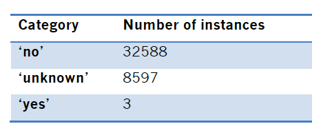
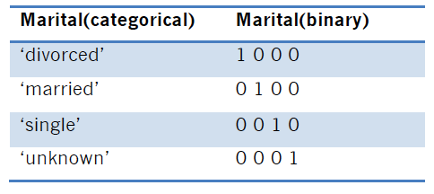
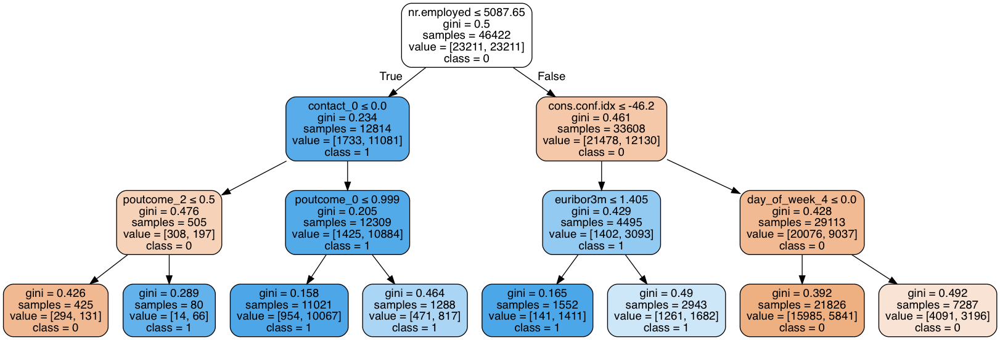

# Predicting Potential Customer Based on Bank Marketing Data

## Project Background

A Portuguese banking institution has been using a direct marketing strategy, cold calling, to achieve their sales target. However, this marketing strategy can be costly. In order to increase profits and stop overspending, this study will analyze their dataset and discuss how to build a model in order to predict the bank’s potential customers who are interested in purchasing a product. 

## Problem Statement

Build a model by predicting their potential customer who would like to subscribe their term deposit according to customers’ personal information, marketing campaigns information and economic context attributes.

## Solution

- Data mining algorithms

Logistic Regression, Decision Tree, SVM, GBDT

- Performance evaluation

While considering precision (TP/(TP+FP)) and recall (TP/(TP+FN)), there was a tradeoff between improving the results. In this study, False Negative (FN) means a “true” potential customer who finally subscribes the product is predicted as negative(0) in the model; False Positive (FP) means a “false” client who finally refuses to purchase the product is
predicted as Positive(+1). When missing “true” potential customers, it would bring a big loss for the bank. And also, while making phone calls to “false” potential customers, it
would waste the time and human resource. Thus, I finally decided to use recall as model performance evaluation, and F1 score (2*(Recall * Precision) / (Recall + Precision)) as an
extra reference.

## Experiments

- Dataset overview

- Missing values processing

There were some attributes with missing values: job, marital, education, default, housing, and loan. I checked the output distribution on the ‘unknown’ instances and applied different methods on these attributes. For some attributes, I treated missing values as a separate class and gave them a new label. However, for the “default” attribute, as there were more than 20% of missing data and the value was seriously unbalanced as shown on the right. Thus, this attribute was finally removed as well.

- One hot encoding method

The one hot encoding method created a set of binary dummy variables.The missing value was labeled as ‘unknown’, which was considered as a new class.

- Imbalanced dataset

I applied oversampling method by duplicating some of the original samples of the minority class.

- Training models (including tuning hyperparameters)

- Decision Tree Visualization

- Gradient Boosting

I generated 100 decision stumps with 1 depth and learning rate = 0.01. The performance of the model was better than tuned decision tree with recall = 0.723 and f1 score = 0.357.

## Results

- Best model

![wew] ()

- Checking feature importance

## Conclusion

In summary, I chose gradient boosting which produced the highest recall compared to other models. Recall plays an important role in the real business problems as KPI. It
would help the bank to increase their profits and reduce additional costs. After selected the best model, I also aimed to inform the bank’s marketing department the importance
of the attributes that I found during the data analysis. (1) ‘euribor3m’ shows high interest rate has a positive effect on customers decision. (2) The ‘cons.price.indx’ attribute indicates customers who have more confidence in the economics. (3) Also, the ‘emp.var.rate’ attribute shows a negative effect on marketing as unstable employment environment could make customers less likely to do investments.

